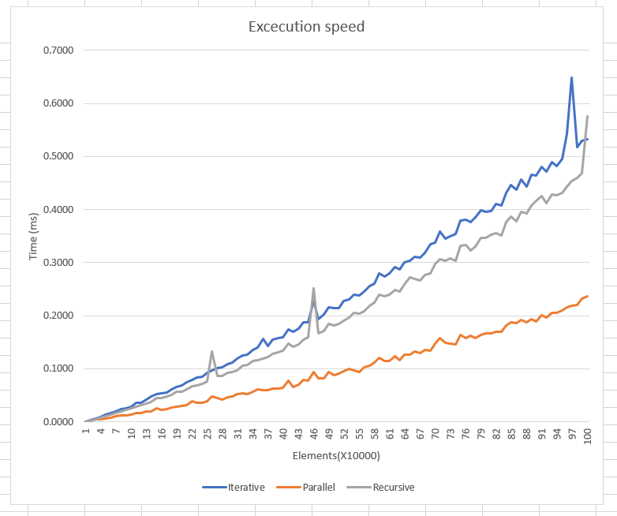
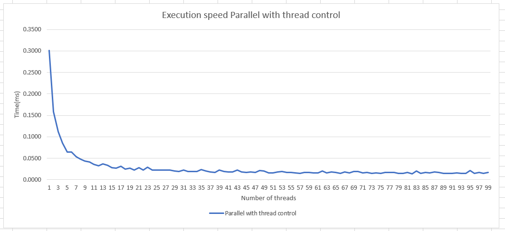

# Quicksort algorithm excecution speed comparisons

In the Quicksort_cpp folder we compare 3 different versions of the quicksort algorithm, where we also test the execution speed with regards to the number of elements in the array that needs to be sorted. 

# Modified versions of Quicksort
A slight alteration of the original quicksort is to spawn a thread whenever we find a pivot element and split the original array into 2 subarrays and perform quicksort on them distibuted between these newly created threads, thus parallelizing the algorithm.
An intereseting modification is to emulate the splitting effect (or if you will the binary tree) and use a stack instead. This method uses iteration unlike the original quicksort, which uses recursion to sort the array. The speedup of this version of the algorithm is negligable as it is nigh identical to the recursive one runtime wise, even at large array sizes.

All test have been run on arrays whose size range between 100 and 1000000.

# Comparing runtime
The comparison of these 3 alterations can be found in the measurement.xlsl file, which is the same as the following:

# Thread control
We limit the number of threads in the parallelized version by specifying the minimum length of the subarray below which no further threads are created, thus preventing the explosion of runtime by thread management overhead. This is easy to imagine as selecting nodes up to the level of the binary tree where each node's (subarray) length is below a certain threshold whose value is predetermined. It is quite trivial to see that selecting the entire tree, or the leaves so to speak will result in a gigantic loss of performance, because the number of threads will increase by 2 every split following the $2^n$ pattern, where $n$ is the level of the binary tree that results from the continous spliting of the original array.

# Measurement of excecution by limiting the maximum number of threads
When we try to limit the number of threads created we get the following graph of the parallel quicksort assuming, of course a constant array size in order to isolate thread based performance:

